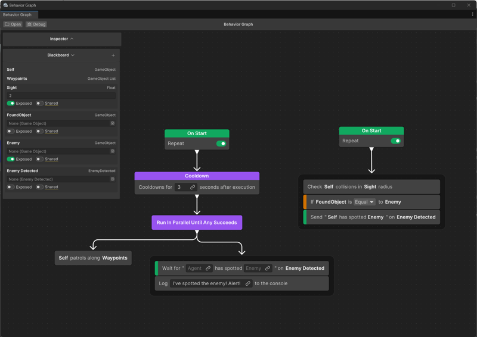

# Event nodes example

This example shows how to use the event nodes to implement an agent that patrols an area and detects nearby enemies. The graph has two main branches: [patrol and detection](#branch-1-patrol-and-detection), and [enemy detection](#branch-2-detect-enemies). The agent follows waypoints on a patrol route and uses the event nodes to detect and respond to nearby enemies dynamically.

To create this behavior graph, follow these steps:

1. In the **Project** view, select **Create** > **Behavior** > **Behavior Graph**.
1. To open the behavior graph, double-click the created asset.
1. On the **Blackboard**, select **+** to add the following variables:
    
    * **Waypoints** (GameObject): Define a list of waypoints for the agent to patrol.
    * **Sight** (Float): Set the detection radius for spotting enemies.
    * **FoundObject** (GameObject): Hold detected objects.
    * **Enemy** (GameObject): Specify enemy targets.
    * **Enemy Detected** (Event): Trigger enemy detection events.

Next, divide the behavior graph into branches. [Branch 1](#branch-1-set-up-patrol-and-enemy-detection) sets up the agent's patrol routine and enemy detection logic. It includes two sub-branches: [patrol routine](#patrol-sub-branch) for waypoint movement and [enemy detection events](#enemy-detection-sub-branch) to monitor enemies. Follow these steps to configure each part.

## Branch 1: Set up patrol and enemy detection

The first branch has two sub-branches: [patrol logic](#patrol-sub-branch) and [agent waits for the enemy spotted event](#enemy-detection-sub-branch).

1. Add an **On Start** node and enable the **Repeat** option.
2. Add a **Cooldown** node and set the cooldown **Duration** to `3` seconds in the **Inspector**.
3. Join the **Cooldown** node to the **On Start** node.
4. Add a **Run In Parallel** node and set **Parallel Mode** to **Until Any Succeed** in the **Inspector**.
5. Follow the instructions in the next two sections to create sub-branches for [patrol routine](#patrol-sub-branch) and [wait for the **Enemy Spotted**](#enemy-detection-sub-branch) event.

### Patrol sub-branch

Follow these steps:

1. Add a **Patrol** node, for example, to move along waypoints.
2. Join the **Patrol** node to the **Run In Parallel** node.

### Enemy detection sub-branch

Follow these steps:

1. Add a **Wait for Event Message** node.
2. Join the **Wait for Event Message** node to the **Run In Parallel** node.
3. Select the **Event Channel** link icon in the **Wait for Event Message** node to link it to the **Enemy Detected** event channel.
4. Add a **Log Message** node and group it with the **Wait For Event Message** node.
5. Set the message to `I've spotted the enemy! Alert!` in the **Inspector**.

## Branch 2: Detect enemies

This branch triggers the **Enemy Detected** event when the agent detects an enemy.

Follow these steps to set up a process that triggers the **Enemy Detected** event when an enemy enters the detection radius:

1. Add a new **On Start** node and enable the **Repeat** option.
2. To add a **Check Collisions in Radius** node:

   1. Join the **Check Collisions in Radius** node to the **On Start** node.

   1. Assign **Self** for the **Agent** field and **Sight** for the **Radius** field.
3. To add a **Conditional Guard** node:

   1. Group the **Conditional Guard** node with the **Check Collisions in Radius** node.

   1. In the **Inspector**, select **Assign Condition** > **Variable Conditions** > **Variable Comparision**.

   1. Select the link icon in the **Variable** field to link it with the **FoundObject** variable.

   1. Select the link icon in the **Comparison Value** field to link it with the **Enemy** variable.
4. To add a **Send Event Message** node:

   1. Group the **Send Event Message** node with the previous nodes.

   1. On the **Send Event Message** node, select the link icon in the **Event Channel** field to link it with the **Enemy Detected** event channel variable.

   1. Select the link icon in the **Agent** field to link it with a variable on the **Blackboard** and select **Self**.

   1. Select the link icon in the **Enemy** field to link it with the **Enemy** variable.

Event nodes ensures prompt communication and coordination between different branches of the behavior graph.

## Additional resources

* [Create a custom node](create-custom-node.md)
* [Use a pre-defined node](predefined-node.md)