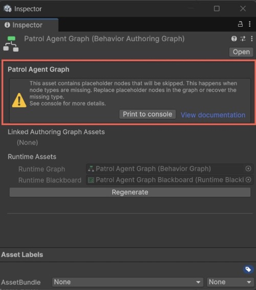

# Mitigation systems in Behavior

When managed references are missing, Unity Behavior includes multiple safety systems that help you identify and resolve issues before they cause project instability or runtime errors. These systems ensure that invalid assets are isolated, logged, and safely managed throughout the workflow.

## Editor-time safety

Behavior includes editor-time checks to prevent use of invalid assets.

* Graph and Blackboard windows automatically close when assets become invalid.
* You can't open invalid assets in editors, and Unity logs an error instead.
* The **Inspector** displays a help box with guidance to resolve issues.

  

* When a type is missing, Behavior assets might change their internal state without user input in order to handle exceptions. When this occurs, messages are logged to inform the user.
* Assets with missing types appear as `(Invalid)` in selectors and can’t be assigned.

These measures protect your assets from corruption and guide you to fix missing or broken references.

## Play mode safety

At runtime, Unity Behavior prevents invalid graphs from causing crashes or unstable behavior.

* Agents with invalid graphs have their graphs nullified and log a clear error message.
* Dynamic subgraphs can also handle invalid assets.
* Informative logs guide you to resolve missing or invalid references.

This ensures your application continues to run, even when the graph data becomes invalid.

## Build-time validation

Unity Behavior automatically cancels builds if it detects invalid assets. These build-time checks maintain data integrity and prevent runtime errors from invalid Behavior graphs.

Advanced users can choose to override this check and build with warnings. This option is useful when invalid graphs exist but aren’t used at runtime. To override the build check, go to **Project Settings** > **Behavior** > **Ignore Missing Managed References in Build**.

## Additional resources

* [Understand `SerializeReference` limitations](understand-limitations.md)
* [How `SerializeReference` limitations affect Behavior assets](behavior-assets-editor-serialization.md)
