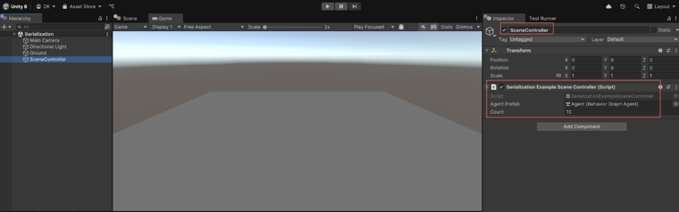

# Script and serialization architecture

In the **Runtime Serialization** sample, the serialization system consists of scene scripts and data classes. 

Use this section to do the following:

* [Learn how `SerializationExampleSceneController` manages agent instantiation](#scene-and-script-breakdown)
* [Understand the save and load operations](#scene-and-script-breakdown)
* [Learn about the underlying data structures like `AgentData` and `SaveData`](#key-classes-and-methods)
* [Explore the basic runtime resolver implementation that restores object links during deserialization](#key-classes-and-methods)

## Scene and script breakdown

The **Runtime Serialization** sample includes a single scene and a main controller script, `SerializationExampleSceneController.cs`. This script performs the following tasks:

* Instantiates all behavior agents in the scene
* Saves agent data to a file named `serializationSaveFile.json`
* Loads agent data from the same file
* Resolves GameObject and prefab references at runtime

The `serializationSaveFile.json` file is automatically created in your project's `Application.dataPath` directory after the first save.

## Key classes and methods

The sample includes the following helper classes and methods to handle agent serialization, data management, and reference resolution at runtime:

* `AgentData`: Stores the agent’s identifier, position, and serialized behavior graph data.
* `SaveData`: A container class that holds a list of `AgentData` objects to serialize.
* `SerializeAgents()` / `DeserializeAgents()`: Methods used to save and load from the `serializationSaveFile.json` file.
* `GameObjectResolver`: A basic runtime reference resolver included at the bottom of the controller script.

> [!NOTE]
> This example uses `GameObject.Find()` and `Resources.FindObjectsOfTypeAll()` to resolve basic references. You're encouraged to create a more efficient resolver for production use.

## Additional resources

* [Set up and run the sample](xref:serialize-run)
* [How behavior graph works](xref:serialize-work)