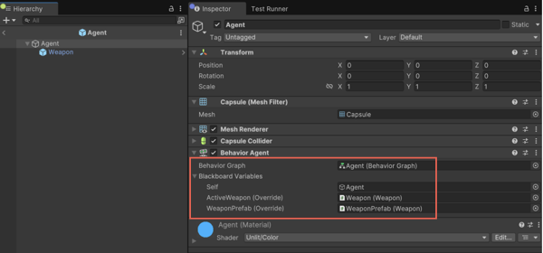

# How behavior graph works 

The `Agent.graph` defines the core behavior logic for each capsule agent in the sample. 

Use this section to do the following:

* [Understand how the graph works](#understand-the-graph)
* [Assign blackboard variables through the prefab](#blackboard-variables)
* [Learn how the agents continuously choose and move to random positions](#behavior-graph-flow)
* [Use the **ChooseTargetPosition** node adds simple randomized behavior](#write-custom-behavior-with-choosetargetposition)
* [Enable variable overrides and runtime serialization with prefab setup](#prefab-setup)

## Understand the graph

The sample behavior graph, `Agent.graph`, defines the logic that drives each capsule’s behavior. It uses a combination of blackboard variables and node sequences to control movement and interaction.

To open the behavior graph, double-click `Agent.graph`. This opens the Unity Behavior editor.

## Blackboard variables

`Agent.graph` uses the following blackboard variables:

| Variable | Description |
| -------- | ----------- |
| **Self** | Reference to the agent’s own GameObject (automatically assigned). | 
| **Target Position** | A `Vector3` position the agent navigates to. |
| **ActiveWeapon** | The currently held weapon. |
| **WeaponPrefab** | Reference to the weapon prefab to instantiate. |

## Behavior graph flow

The flow of the graph determines how the agent behaves over time. 

In `Agent.graph`, the logic flow is as follows:

* The **On Start** node has **Repeat** set to true, so that the graph can loop continuously.
* A **Sequence** node ensures actions run in the following order:

   1. **ChooseTargetPosition** node: selects a random location
   2. **Navigate to Target Position**: moves the agent to that location

This loop continues indefinitely and produces autonomous, randomized movement for each capsule. To learn more about the nodes, select the relevant node and view the details in the **Inspector**.

## Prefab setup

Each capsule is an **Agent** prefab with a **Behavior Agent** component.

* The **Self** variable is automatically bound to the GameObject.
* The **ActiveWeapon (Override)** and **WeaponPrefab (Override)** variables are manually assigned.

The setup shows how to save and load objects that reference other objects in the scene or external prefabs.

Unity can’t serialize GameObject references directly. To work around this, the sample uses a `GameObjectResolver` to resolve object references during deserialization, based on saved agent identifiers. The [`SerializationExampleSceneController`](#scene-and-script-breakdown) script includes a basic implementation of this resolver.

## Write custom behavior with `ChooseTargetPosition`

The `ChooseTargetPosition` script is a simple example of a custom behavior node. It picks a random point within a defined range and sets this as the agent’s **TargetPosition**.

## Additional resources

* [Scripts and serialization architecture](xref:serialize-scripts)
* [Save and load running graph state](xref:serial)